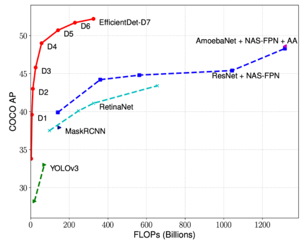
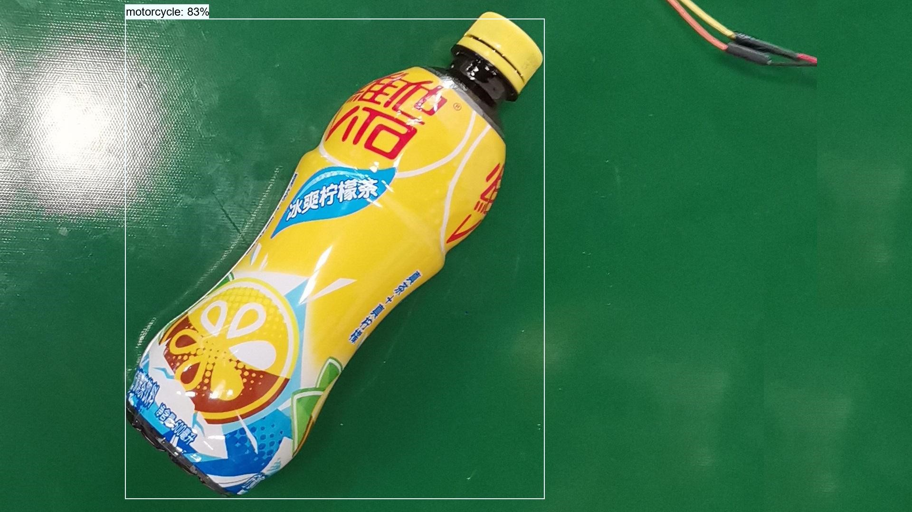
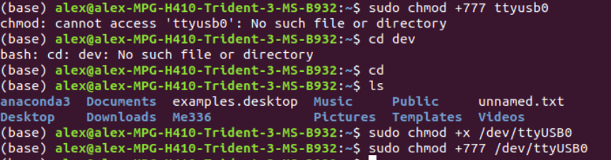

# Learning to Pick with 2D Images
> Assignment Project #1: 30% | Due Sunday, Mar 28

------

## Target
This experiment is mainly divided into two parts. They are 2D calibration and object capture respectively. The goal of 2D calibration is to establish the transformation basis of the camera coordinate system and the manipulator coordinate system, that is, the hand-eye transformation matrix used to describe the relative spatial pose of the manipulator and the camera. On this basis, object grasping is to get the grasping coordinates through the camera image recognition and control the movement of the manipulator to grasp.

## Hardware List
The hardware equipment required for this experiment is as follows:
- camera: Intel Realsense
- mechanical arm: Aubo i5
- calculation platform: computer
- calibration: 3D-printed nib and base (mounted on manipulator arm)
- calibrators: 3D-printed nib (for calibration on a flat surface)
- clamping device:  pneumatic clamping jaw (air compressor and air valve)
- grasped objects:  plastic bottles, cans

## Algorithm
In the sample project, we successfully used YOLO v5 algorithm to achieve object detection and 2D picking. We also tried YOLO v4 algorithm which performed better accuracy but longer running time.

In addition to YOLO, we tried a more powerful method, named EffcientDet as our object detection algorithm. EfficientDets are a family of object detection models, which achieve state-of-the-art 55.1mAP on COCO test-dev, yet being 4x - 9x smaller and using 13x - 42x fewer FLOPs than previous detectors. The models also run 2x - 4x faster on GPU, and 5x - 11x faster on CPU than other detectors.
EfficientDets are developed based on the advanced backbone, a new BiFPN, and a new scaling technique:


The model family starts from EfficientDet-D0, which has comparable accuracy as YOLOv3. The baseline model was scaled up by using the compound scaling method to obtain a list of detection models EfficientDet-D1 to D6, with different trade-offs between accuracy and model complexity.


Then we used EfficientDet-D0 to do the object detection and we successfully obtained the bounding box. As we can see, the results are pretty good.


## Preparation
1. Connect the power supply and plug in the AUBO.
2. Turn the black knob in the main machine of AUBO from ON to the red emergency stop button upward to the right to unlock the emergency mode.
3. Turn the emergency stop button on the teaching device up to the right, open the teaching device and click the save button in the popover.
4. Connect the control box to the main machine with network cable.
5. Right-click on the desktop to open the terminal and enter the following code to open PyCharm.
```python
cd Downloads/pycharm-community-2020.3.3/bin
sh pycharm.sh
```
6. Enter the following code in the terminal to turn on the camera.
```
realsense-viewer
```

## Experiment

1. Install the calibration nib 1 on the flange at the end of the manipulator.
2. Click RGB Camera Off and open the Camera.
3. Adjust RealSense and Camera Shelves.
4. Start the manipulator arm.
5. Adjust the end of the code to [x, y, 0.04, 3.14, 0, 1.57] and run it.
6. Place the calibrator on the platform so that the two vertices of the calibrator and the calibration plate are on the same vertical line.
7. Adjust the end of the code to [0.3, 0.0, 0.5, 3.14, 0.0, 0.0] and run it. The robotic arm is then removed from view.
8. Slide the mouse to the vertex of the calibration object on the RealSense interface and read the pixel value (U, V) above.
9. Open configs/basic_config/ cail2d.yaml in PyCharm
10. Record the given (x, y) value and the (u,v) value read by the RealSense-Viewer into cail2d.yaml opened by PyCharm.
11. Repeat steps 5-9 for 4 times to get 4 groups of (x, y) values and their corresponding 4 groups of pixel values (u,v), that is, to complete data collection for 2D calibration.
12. According to the configuration file cail2D. Yaml to calculate the hand-eye matrix and run ME336-2021 spring/deepclaw/modules / * * / * * calibration Calibration2D. Py.
13. Modify two values in the figure, which correspond to pixel points in the camera coordinate system.
14. Open the real-sense corresponding to the pixel above and find a point, and place a calibrator on the desktop corresponding to the pixel.
15. Right-click and run Calibration2d.py to get two values in the run box.
16. Open auboi5Control.py and modify it according to the values obtained in the previous step.
17. Right click and run Auboi5Control.py to observe the movement of the manipulator arm.
18. Obtain the gap between the end of the manipulator calibration plate and the calibration object in the plane to check whether the error is reasonable.
19. Setup the gripper.
20. Open Realsense-Viewer and customize a rectangular area on the conveyor belt that is the camera recognition area.
21. Open the main.py file.
22. Modify crop_bounding = [y1, y2, x1, x2].
23. In Realsense-Viewer, read the pixel coordinates (x1,y1) on the upper left and (x2,y2) on the lower right. Modify crop_bounding = [y1, y2, x1, x2].
24. Place an empty bottle on the manipulator operating platform to ensure that it is within the visual field and that there is no other sundries in the center of the visual field.
25. Modify the z and adjust the grasping height.
26. Open main.py in the image, right-click and run. Note that the Realsense-viewer is off.
27. Observe the movement of the manipulator arm.

## Video
https://www.bilibili.com/video/BV1P64y1Q7Hy/

## Challenges and Solutions
- 2D calibration: It is better to re-calibrate 2D calibration before each 2D grasping experiment. Once the placement position of the camera is affected by external factors, it will bring great errors to our 2D calibration results, resulting in the failure of the final clip 
- Proper 2D Camera resolution: When adjusting RealSense, open the RGB Camera and adjust its pixels to 1280*720. At first, when we carried out 2D calibration, we used the default resolution. Low resolution led to large error of calibration results and incorrect coordinates. 
- Need to resolve permission issue before running main.py in 2d_picking:


## Conclusion
In this project, object recognition is the key to pick with images. we propose EfficientDet to recognize the object. To compare the performance, we ran three normal algorithms, yoloV4, yoloV5 and EfficientDet. First, we tried yoloV5 provided by the tutorial. And we also tried yoloV4, which has a higher accuracy in recognizing objects. But yoloV4 is much slower than yoloV5. When recognizing multiple images, yoloV5 has an average processing time of 7ms per image, that’s 140 FPS, and that is an incredible achievement. Considering we aim at grabing garbage, a faster solving program is exactely what we need. We also tried EfficientDet to detect the target objects. It is a little bit slowly than yoloV5, and has similay accuracy. But the problem is when we require more accuracy and apply different EfficientDet algorithms, the running time of the progrim is raising so fast that it becomes a great disadvantage. However, these algorithms all have a common regret, that is, the bounding frame cannot be tilted. When the object is tilted in the camera field of view, the bounding frame is still parallel to the x- and y-axis, which leads to the robot arm still grasping along the x- or y-axis. Although it is still effective for grasping plastic bottles and cans, it may cause problems for other items. Therefore, this is an optimization direction in the future.

After we find out the way to recognize the object, we provide the position to the Aubo i5 and grasp. After many experiments, the success rate of grasping plastic bottles and cans is very high. But paper and other thin items are difficult to grasp, is due to the structure of the claw restrictions. These are what we can improve on and hopefully will be addressed in Project 3.
